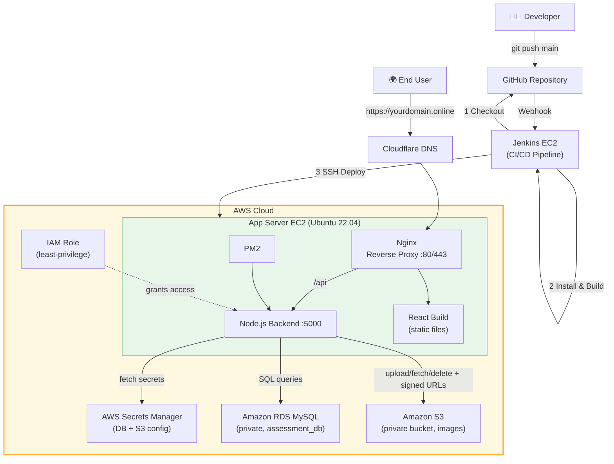
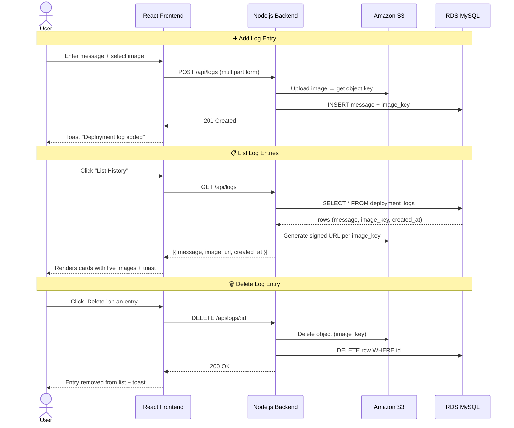

<div align="center">

# 📦 Deployment Log Tracker

**A lightweight, cloud-native log tracker built to demonstrate a complete AWS DevOps pipeline —
from a React/Node application to fully automated CI/CD deployment.**

[](https://nodejs.org/)
[](https://react.dev/)
[](https://aws.amazon.com/)
[](https://www.jenkins.io/)
[](https://www.mysql.com/)
[](#license)

</div>

---

## 📖 Overview

**Deployment Log Tracker** is a minimal full-stack application where users can log a short note
with an accompanying screenshot/image — think of it as a mini audit trail for deployments. It
was built to showcase a production-style AWS deployment: direct EC2 hosting (no containers),
private RDS, private S3 with signed URLs, secrets pulled from AWS Secrets Manager at runtime,
and a Jenkins pipeline that auto-deploys on every push to `main`.

| | |
|---|---|
| **Frontend** | React (Vite) |
| **Backend** | Node.js + Express |
| **Database** | MySQL (Amazon RDS) |
| **Storage** | Amazon S3 (private, signed URLs) |
| **Secrets** | AWS Secrets Manager |
| **CI/CD** | Jenkins (GitHub webhook triggered) |
| **Web Server** | Nginx (reverse proxy) + PM2 (process manager) |
| **Domain/SSL** | Cloudflare DNS + Let's Encrypt (Certbot) |

---

## ✨ Features

- 📝 Add a log entry with a text note + image upload
- 📋 Load all entries on demand via the **List History** button, with images loaded via
  **temporary signed S3 URLs**
- 🗑️ Delete an entry (removes both the S3 object and the database record)
- 🔔 Toast notifications confirm every add/list/delete — success or failure
- 🔒 Zero hardcoded credentials — all secrets fetched from **AWS Secrets Manager** at runtime
  (falls back to `.env` for local dev)
- ⚙️ Fully automated deployment — push to `main` → Jenkins builds & deploys, no manual steps
- 🌐 Custom domain with HTTPS (Let's Encrypt), no load balancer required

---

## 🗄️ Database Schema

Table `deployment_logs` (created automatically at backend startup if it doesn't exist):

| Column | Type | Notes |
|---|---|---|
| `id` | `INT` | Primary key, auto increment |
| `message` | `VARCHAR(255)` | Not null |
| `image_key` | `VARCHAR(255)` | Not null — S3 object key only, never a full URL |
| `created_at` | `TIMESTAMP` | Default `CURRENT_TIMESTAMP` |

---

## 🏗️ Architecture Diagram



---

## 🔄 User Flow Diagram



---

## 📁 Project Structure

```
deployment-log-tracker/
├── backend/
│   ├── src/
│   │   ├── config.js       # Loads secrets (Secrets Manager → .env fallback)
│   │   ├── db.js           # MySQL connection pool + schema bootstrap
│   │   ├── s3.js           # S3 client + upload/delete/signed URL helpers
│   │   ├── routes/logs.js  # /api/logs — POST, GET, DELETE
│   │   ├── app.js          # Express app (CORS, routes, error handling)
│   │   └── server.js       # Entry point
│   ├── .env.example
│   └── package.json
├── frontend/
│   ├── src/
│   │   ├── App.jsx
│   │   ├── main.jsx
│   │   ├── toast.jsx        # Toast notification context/provider
│   │   ├── index.css
│   │   ├── components/
│   │   │   ├── AddLogForm.jsx
│   │   │   └── LogList.jsx
│   │   └── api.js
│   ├── index.html
│   ├── vite.config.js
│   ├── .env.example
│   └── package.json
├── Jenkinsfile
├── AWS_DevOps_Deployment_Guide.md
├── .gitignore
└── README.md
```

---

## 🔌 API Reference

| Method | Endpoint | Description | Body |
|---|---|---|---|
| `POST` | `/api/logs` | Add a new log entry | `multipart/form-data` → `message`, `image` |
| `GET` | `/api/logs` | List all entries with signed image URLs | — |
| `DELETE` | `/api/logs/:id` | Delete an entry (S3 object + DB row) | — |

**Example response — `GET /api/logs`**
```json
[
  {
    "id": 1,
    "message": "Fixed login bug",
    "image_url": "https://<bucket>.s3.amazonaws.com/...&X-Amz-Signature=...",
    "created_at": "2026-08-03T10:15:00.000Z"
  }
]
```

---

## ⚙️ Environment Variables

No values are ever hardcoded. Locally, use `.env`; in production, values are pulled live from
**AWS Secrets Manager** using the secret name below.

**`backend/.env.example`**
```env
# MySQL (RDS) connection
DB_HOST=your-rds-endpoint.rds.amazonaws.com
DB_USER=your_db_user
DB_PASSWORD=your_db_password
DB_NAME=deployment_log_tracker

# AWS
AWS_REGION=us-east-1
# Leave these unset to use the default AWS credential provider chain
# (IAM role, ~/.aws/credentials, etc). Only set them for local dev.
AWS_ACCESS_KEY_ID=
AWS_SECRET_ACCESS_KEY=

# S3
S3_BUCKET_NAME=your-s3-bucket-name

# Server
PORT=5000
# Origin allowed to call this API (the frontend's URL)
CORS_ORIGIN=http://localhost:5173

# Production only: name/ARN of a Secrets Manager secret holding a JSON object
# with DB_HOST, DB_USER, DB_PASSWORD, DB_NAME, S3_BUCKET_NAME, AWS_REGION.
# When set, these override the values above. Leave unset for local dev.
SECRETS_MANAGER_SECRET_NAME=
```

**`frontend/.env.example`**
```env
# Base URL of the backend API (no trailing slash, no /api suffix — the
# frontend appends /api/logs itself)
VITE_API_BASE_URL=http://localhost:5000
```

---

## 🚀 Local Setup

```bash
# 1. Clone
git clone https://github.com/HaseebAhmad24-collab/deployment-log-tracker.git
cd deployment-log-tracker

# 2. Backend
cd backend
cp .env.example .env   # fill in local DB/S3 values or a Secrets Manager name
npm install
npm run dev

# 3. Frontend (new terminal)
cd frontend
cp .env.example .env
npm install
npm run dev
```

Backend listens on `PORT` (default `5000`). Frontend runs on `http://localhost:5173` (Vite).

---

## ☁️ Production Deployment

| Stage | Tooling |
|---|---|
| Infrastructure | EC2 (App Server), EC2 (Jenkins), RDS MySQL (private), S3 (private) |
| Secrets | AWS Secrets Manager, fetched at app startup |
| Access control | IAM role (least privilege) on the App Server — no static AWS keys in code |
| Web server | Nginx reverse proxy → PM2-managed Node process |
| CI/CD | Jenkins pipeline, triggered by GitHub webhook on every push to `main` |
| Domain/SSL | Cloudflare DNS (A record → EC2 IP) + Certbot (Let's Encrypt) |

Full step-by-step infrastructure setup is documented separately in
[`AWS_DevOps_Deployment_Guide.md`](./AWS_DevOps_Deployment_Guide.md).

### CI/CD Pipeline Flow
1. Developer pushes to `main` on GitHub
2. GitHub webhook triggers the Jenkins pipeline
3. Jenkins checks out the code, installs dependencies, builds the frontend
4. Jenkins SSHes into the App Server, pulls the latest code, rebuilds, and restarts the app via PM2
5. Pipeline verifies the deployment with a health check request
6. Zero manual steps required after `git push`

---

## 🔐 Security Notes

- RDS has **no public access** — reachable only from the App Server's security group
- S3 bucket blocks **all public access** — images are served via short-lived **signed URLs**
- IAM role attached to the App Server is scoped to only the specific S3 bucket and Secrets Manager secret it needs
- No credentials, API keys, or connection strings are committed to source control
- HTTPS enforced via Let's Encrypt, with automatic certificate renewal

---

## 📝 Assumptions

- Single-region deployment, no high-availability/multi-AZ setup (out of scope for this assessment)
- Domain DNS is managed via Cloudflare in "DNS only" mode since SSL is handled by Certbot on the origin server
- No ALB is used — DNS resolves directly to the EC2 App Server's public IP, per assessment requirements
- Application runs directly on EC2 (PM2), no containers/Docker

---

## 📄 License

This project is provided as-is for assessment/demonstration purposes.

<div align="center">

Built with ❤️ for the AWS DevOps Engineer Technical Assessment

</div>
